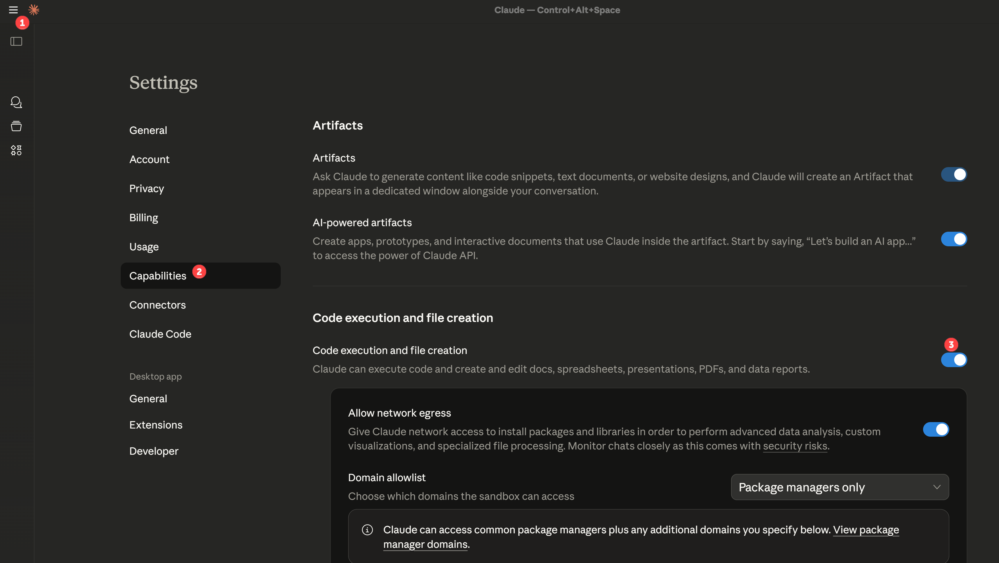
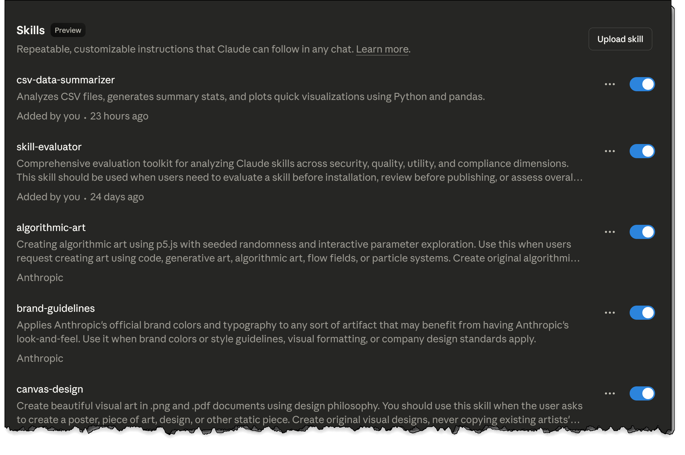

# Capital Slice: A 4-week end-to-end "build along in public" Claude Skill to perform and automate a complex real-world business challenge

**Author:** Brian Julius
**Technical Assistance:** Claude Code (Anthropic)

## THE MOTIVATION ##

A few weeks ago, I asked for feedback about my LinkedIn content and where I should focus it next. Overwhelmingly, the feedback I got was that people wanted to learn how to implement this sort of analysis and automation from beginning to end, on a real-world problem similar to what they we'd be building in there on work.

I've tried to make this exercise as realistic as possible, touching on many of the techniques and themes I use in building my own Claude Skills. 

## THE PLAYERS

You are a partner in newly-formed three-person venture, **Capital Slice**, a premium pizza-by-the-slice operation with two food trucks in Washington DC. 

The players are 

🔸Raven, a very talented, confident young chef who recently relocated to the East Coast after spending the past two and a half years in Italy, and is looking to make a name for herself in the highly competitive DC market.

🔸 Brian, an investor and longtime DC resident with deep knowledge of this market and a strong network.  He recently acquired two brand-new food trucks far below cost via a timely bid in an asset forfeiture action against a DC restauranteur convicted of wire fraud and tax evasion

🔸 You, a data analyst with a track record of analyzing complex service markets, quickly pinpointing market drivers that give your clients an edge, and implementing automated systems that enable them consistently stay a step or two ahead of the competition. 

Brian and Raven have studied the DC food truck market and envision Capital Slice as a strong entrant into the market - few direct competitors, high profit margins, leverages culinary strengths Raven built while working in Naples and Turin, and the trucks obtained in the forfeiture action are well-equipped for pizza making.

# YOUR OBJECTIVE

Saturdays are the days that make or break a food truck business.  If you can build a system that provides a sizable, consistent competitive edge on the most heavily contested day, it should dominate as we expand the business to less competitive days.

Every Thursday by 11:59pm ET, you must complete your analysis and send a decision memo to Raven and Brian with the positioning strategy for each truck for the upcoming Saturday.

**The complexity:**

- 10 permitted locations across DC, each with unique characteristics
- Weather impacts different locations differently (bad weather helps indoor venues)
- Events (sports games, conventions, festivals) create traffic spikes
- Competitors are solving the same optimization problem
- Each truck can relocate once mid-day (morning → afternoon)

**The goal:** Build an automated decision support system that ingests weekly data and recommends optimal truck positioning.

## Background Materials

Brian has prepared three documents to help you gain a handle on specifics of this market and to serve as context for your skill build (in Claude Code just pointed to the folder you downloaded these into.  If you're using Claude Desktop, create a project and put these files into the project context.)

| File | Description |
|------|-------------|
| `dc-locations-map.html` | Interactive map of all 10 permitted locations with landmarks and time profiles |
| `Capital Slice Site Analysis.md` | Detailed strategic analysis of each location |
| `Capital-Slice-business-challenge-briefing.md` | Full business context and requirements |

## Live Map

View the interactive location map: [Capital Slice DC Locations](https://bjulius.github.io/capital-slice/dc-locations-map.html)

## Using Claude Skills for This Project

This project is designed to be built using **Claude Skills** — reusable capabilities that extend and automate Claude's abilities for specific domains or workflows.

Brian recommends using Claude Code for this project.  Create a project folder for this effort, download the briefing files from this GitHub repo and point Claude Code at that folder

## Configuring Skills for the First Time ##

The easiest way to do this is to go in through Claude Desktop to Settings and make sure the "Code Execution and file creation" option is activated

Then, make sure that your other skills are activated.

I recommend just turning all of these on. They won't take up any significant space until you call them, which for this project, you probably won't. The one you need to make sure is on though is called skill-creator, created by Anthropic, which guides Claude in helping you build other skills.  We are going to use this one extensively in this project.

Now when you install Claude Code from the settings, I believe it will carry your previously installed skills over but if it do so automatically, you can just ask Claude to transfer those settings over for you

## Series Schedule

This is a 4-week build-along series:

1. **Week 1:** initial build of Claude skill to perform analysis and create truck positioning memo
2. **Week 2:** testing, evaluating and improving your initial Claude skill
3. **Week 3:** source control and documenting your Claude's skill 
4. **Week 4:** distributing and maintaining your Claude skill

Starting today and for the next four weeks. I will post every Monday with analysis of the previous week and instructions for the next.  Use the comment section of my post each week o ask any questions and discuss your build efforts throughout the week, I will follow the comments and try to respond as promptly as possible. So that everyone can benefit from this exercise, please use the comment section rather than messaging me directly.

## License

This project is for educational purposes as part of the Claude Skills development series.